# Tres en Raya ❌ ⭕
 
## 1. Descripción general

El proyecto **Tres en Raya** consiste en el desarrollo de un juego clásico en Java que ofrece dos formas de interacción:

- **Versión consola:** Permite jugar directamente desde la terminal, gestionando turnos y comprobaciones de ganador o empate mediante texto.
- **Versión gráfica (GUI):** Implementada con la librería **Swing**, incluye un menú de inicio, un tablero interactivo con botones, iconos personalizados para las fichas (❌ y ⭕) y un marcador que contabiliza las victorias de cada jugador.

La aplicación está organizada siguiendo el principio de separación de responsabilidades:
- **Modelo:** Contiene la lógica del juego (tablero, fichas y partida).
- **Interfaz gráfica:** Gestiona la interacción con el usuario mediante ventanas y botones.
- **Control:** Coordina la comunicación entre el modelo y la interfaz.

El objetivo del proyecto es proporcionar una experiencia de juego sencilla pero completa, asegurando que los jugadores puedan disfrutar de partidas sucesivas con un registro de resultados.

## 2. Objetivos del proyecto

| Tipo       | Objetivo                                                                                                           | Criterio SMART                                |
| ---------- | ------------------------------------------------------------------------------------------------------------------ | --------------------------------------------- |
| General    | Desarrollar una aplicación de Tres en Raya en Java con versión consola y GUI que incluya un marcador de victorias. | Relevante, alcanzable                         |
| Específico | Implementar la lógica del juego (tablero, fichas, turnos, ganador/empate).                                         | Plazo máximo: 1 semana                        |
| Específico | Diseñar la interfaz gráfica en Swing con tablero, menú de inicio y botones interactivos.                           | Plazo máximo: 2 semanas                       |
| Específico | Incorporar un marcador de victorias que se actualice automáticamente tras cada partida.                            | Medible por número de partidas registradas    |
| Específico | Gestionar entradas inválidas (posiciones fuera del tablero o casillas ocupadas).                                   | Correcto funcionamiento en todas las partidas |
| Específico | Ofrecer una experiencia visual amigable con colores e iconos personalizados.                                       | Evaluación de usabilidad y estética           |

## 3. Requisitos funcionales

| ID   | Requisito funcional                                                            |
| ---- | ------------------------------------------------------------------------------ |
| RF1  | El sistema debe permitir que jueguen dos jugadores en el mismo dispositivo.    |
| RF2  | El sistema debe mostrar un tablero de 3x3 de manera visual.                    |
| RF3  | El sistema debe permitir colocar fichas ❌ y ⭕ en las posiciones libres.        |
| RF4  | El sistema debe comprobar si existe un ganador después de cada jugada.         |
| RF5  | El sistema debe detectar empates cuando el tablero esté lleno sin un ganador.  |
| RF6  | El sistema debe alternar los turnos entre jugador ❌ y jugador ⭕.               |
| RF7  | El sistema debe mostrar mensajes de victoria o empate al finalizar la partida. |
| RF8  | El sistema debe llevar un marcador de partidas ganadas por cada jugador.       |
| RF9  | El sistema debe permitir reiniciar la partida manteniendo el marcador.         |
| RF10 | El sistema debe permitir salir al menú de inicio o cerrar la aplicación.       |

## 4. Requisitos No Funcionales

| ID     | Descripción                                                         | Categoría      | Métrica / Indicador                  | Nivel Objetivo / Comentarios                           |
| ------ | ------------------------------------------------------------------- | -------------- | ------------------------------------ | ------------------------------------------------------ |
| RNF-01 | La interfaz debe ser clara y fácil de usar                          | Usabilidad     | Evaluación por pruebas de usuario    | Navegación intuitiva y botones accesibles              |
| RNF-02 | El juego debe ejecutarse en cualquier sistema con Java 8 o superior | Portabilidad   | Sistemas compatibles                 | Pruebas en Windows, macOS y Linux                      |
| RNF-03 | Separación de la lógica de juego y la interfaz                      | Mantenibilidad | Arquitectura MVC                     | Paquetes separados: `model`, `ui`                      |
| RNF-04 | Las operaciones del tablero deben ser eficientes                    | Rendimiento    | Tiempo de ejecución de métodos clave | Operaciones O(1) o O(n) según corresponda              |
| RNF-05 | El sistema debe manejar errores de entrada                          | Robustez       | Sin bloqueos o crashes               | Validación de posiciones inválidas y casillas ocupadas |
| RNF-06 | Diseño visual atractivo                                             | Estética       | Evaluación por apariencia            | Tema oscuro, uso de iconos personalizados              |
| RNF-07 | Marcador de partidas debe actualizarse correctamente                | Confiabilidad  | Correcta actualización de victorias  | Contabiliza victorias de X y O durante la sesión       |

## 5. Diagramas UML

### 5.1 Diagrama de Casos de Uso

```mermaid
flowchart LR
    %% Actores
    J1(("👤 Jugador X"))
    J2(("👤 Jugador O"))

    %% Sistema
    subgraph "Sistema Tres en Raya"
        C1(("Iniciar partida"))
        C2(("Colocar ficha"))
        C3(("Cambiar turno"))
        C4(("Detectar ganador"))
        C5(("Detectar empate"))
        C6(("Mostrar marcador"))
        C7(("Reiniciar partida"))
        C8(("Salir al menú"))
    end

    J1 --> C2
    J2 --> C2
    C2 --> C3
    C2 --> C4
    C2 --> C5
    C1 --> C6
    C7 --> C6
```

### 5.2 Diagrama de Interacción (Secuencia: Realizar jugada y actualizar marcador)

```mermaid
    sequenceDiagram
    actor JugadorX
    actor JugadorO
    participant GUI
    participant Partida
    participant Tablero

    JugadorX->>GUI: Selecciona celda para colocar ❌
    GUI->>Partida: jugar(fila, col)
    Partida->>Tablero: ponerFicha(ficha, fila, col)
    Tablero-->>Partida: éxito/ocupado
    Partida-->>GUI: Resultado jugada
    GUI-->>JugadorX: Actualiza tablero y turno
    Partida->>Partida: verificar ganador/empate
    Partida-->>GUI: Actualizar marcador

    JugadorO->>GUI: Selecciona celda para colocar ⭕
    GUI->>Partida: jugar(fila, col)
    Partida->>Tablero: ponerFicha(ficha, fila, col)
    Tablero-->>Partida: éxito/ocupado
    Partida-->>GUI: Resultado jugada
    GUI-->>JugadorO: Actualiza tablero y turno
    Partida->>Partida: verificar ganador/empate
    Partida-->>GUI: Actualizar marcador
```

### 5.3 Diagrama de Estado (Ciclo de vida de una partida)

### 5.4 Diagrama de Clases UML (Completo)

## 6. Matriz de Trazabilidad Ampliada

### Requisitos Funcionales

| **ID Req.** | **Descripción del Requisito**                                  | **Casos de Uso**                  | **Clases / Métodos**                                                   | **Casos de Prueba**                                                       |
|-------------|----------------------------------------------------------------|----------------------------------|------------------------------------------------------------------------|---------------------------------------------------------------------------|
| RF1         | Permitir que dos jugadores jueguen en el mismo dispositivo     | Iniciar partida, Colocar ficha   | `Partida.jugar()`, `Tablero.ponerFicha()`, `Ficha.siguiente()`        | Verificar alternancia de turnos y colocación correcta de fichas           |
| RF2         | Mostrar el tablero de 3x3                                      | Iniciar partida, Colocar ficha   | `Tablero.toString()`, `JuegoGUI`                                       | Comprobar representación correcta del tablero antes y después de jugadas  |
| RF3         | Colocar fichas ❌ y ⭕ en posiciones libres                     | Colocar ficha                     | `Tablero.ponerFicha()`                                                 | Intentar colocar en casilla vacía y ocupada                               |
| RF4         | Comprobar si existe un ganador                                  | Colocar ficha                     | `Partida.ganador()`, `Tablero.gana()`                                  | Verificar detección de victoria horizontal, vertical y diagonal           |
| RF5         | Detectar empates cuando el tablero esté lleno                  | Colocar ficha                     | `Partida.terminada()`, `Tablero.estaLleno()`                           | Llenar tablero sin ganador y verificar mensaje de empate                  |
| RF6         | Alternar turnos entre jugador ❌ y jugador ⭕                     | Colocar ficha                     | `Ficha.siguiente()`, `Partida.turno`                                   | Comprobar que turno cambia después de cada jugada                         |
| RF7         | Mostrar mensajes de victoria o empate                           | Colocar ficha                     | `Partida.toString()`, `JuegoGUI`                                       | Verificar aparición de mensaje correcto según el estado de la partida     |
| RF8         | Llevar un marcador de partidas ganadas                          | Iniciar partida, Colocar ficha   | `JuegoGUI.lblMarcador`                                                 | Comprobar que el marcador se actualiza correctamente tras cada victoria   |
| RF9         | Permitir reiniciar la partida manteniendo el marcador           | Reiniciar partida                 | `JuegoGUI.reiniciarPartida()`                                          | Comprobar que tablero se reinicia pero marcador permanece                 |
| RF10        | Permitir salir al menú de inicio o cerrar la aplicación         | Salir al menú                     | `JuegoGUI`, `Juego.arrancarJuego()`                                     | Comprobar que se vuelve al menú o se cierra la aplicación                |

---

### Requisitos No Funcionales

| **ID RNF** | **Descripción**                                          | **Requisitos Impactados**       | **Clases Relacionadas**          | **Casos de Prueba**                                                    |
|------------|----------------------------------------------------------|--------------------------------|---------------------------------|------------------------------------------------------------------------|
| RNF-01     | Interfaz clara y fácil de usar                            | RF1, RF2, RF7                  | `JuegoGUI`                      | Evaluación por usuario: botones visibles y comprensibles               |
| RNF-02     | Compatible con Java 8 o superior                         | Todos                          | `Juego`, `JuegoGUI`             | Ejecutar en distintos SO con Java 8+                                    |
| RNF-03     | Separación de lógica de juego y GUI                      | RF1-RF10                        | `model`, `ui`                   | Revisar arquitectura MVC: clases `model` y `ui` separadas              |
| RNF-04     | Eficiencia en operaciones del tablero                    | RF3, RF4, RF5                  | `Tablero`                        | Verificar tiempos de respuesta al colocar ficha y verificar ganador     |
| RNF-05     | Manejo de errores de entrada                              | RF3, RF6                        | `Juego`                          | Probar posiciones fuera de rango o casillas ocupadas                   |
| RNF-06     | Diseño visual atractivo                                   | RF2, RF8                        | `JuegoGUI`                      | Comprobar colores, iconos y estética                                    |
| RNF-07     | Marcador confiable                                        | RF8                             | `JuegoGUI.lblMarcador`          | Verificar que victorias de X y O se contabilicen correctamente          |
